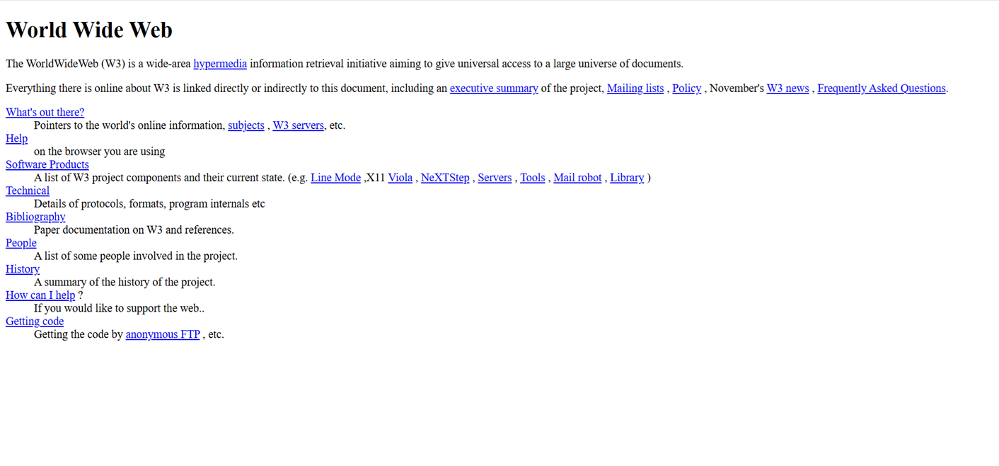

# World Wide Web

A recreation of the world's first website using semantic HTML5.

## 🔗 Live Demo & Source Code

🌐 **GitHub Pages:**  
https://akshaygir15.github.io/frontend-projects/pract-1-world-wide-web/

🌐 **Netlify:**  
https://world-wide-web-akshay.netlify.app/

💻 **Source Code:**  
https://github.com/akshaygir15/frontend-projects/tree/main/pract-1-world-wide-web/

---

## 📸 Project Preview



---

## World Wide Web

This project is a recreation of the world's first website, **The World Wide Web Project**, originally created by Sir Tim Berners-Lee at CERN in 1991. It was developed using only HTML, closely following the layout and content of the original webpage hosted by CERN.

The objective of this project was to gain a practical understanding of the fundamental building blocks of HTML by recreating one of the most historically significant webpages on the Internet.

---

## What is the World Wide Web?

The **World Wide Web (WWW)** is an information system that enables documents and other web resources to be accessed over the Internet using hyperlinks. It was invented by **Sir Tim Berners-Lee** while working at CERN in 1989 and became publicly available in 1991.

The first website was created to explain the World Wide Web project itself. It introduced concepts such as hypertext, web servers, browsers, and document linking, laying the foundation for the modern web that billions of people use today.

---

## About This Project

This project recreates the original World Wide Web homepage using semantic HTML elements without any CSS or JavaScript.

The webpage contains:

- Headings
- Paragraphs
- Hyperlinks
- Description Lists
- Multiple references to original CERN resources

The goal was to understand how webpages were originally structured before the introduction of CSS and modern frontend frameworks.

---

## Features

- Recreated the original CERN homepage
- Built entirely using HTML5
- Semantic HTML structure
- Functional hyperlinks
- Mobile viewport support
- Beginner-friendly project

---

## Technologies Used

- HTML5

---

## Learning Outcomes

While building this project, I learned about:

- HTML document structure
- Semantic HTML elements
- Headings and paragraphs
- Anchor (`<a>`) tags
- Description Lists (`<dl>`, `<dt>`, `<dd>`)
- Relative and absolute hyperlinks
- HTML comments
- Page metadata

---

## Reference

The webpage was recreated by referring to the original CERN website:

https://info.cern.ch/hypertext/WWW/TheProject.html

---

## Project Structure

```text
pract-1-world-wide-web/
│
├── index.html
└── README.md
```

---

## Future Improvements

Some improvements that can be added in future versions include:

- Styling using CSS
- Responsive layout
- Dark mode
- Accessibility enhancements
- Modern typography while preserving the original content

---

## Author

**Akshay Gir**

GitHub: https://github.com/akshaygir15